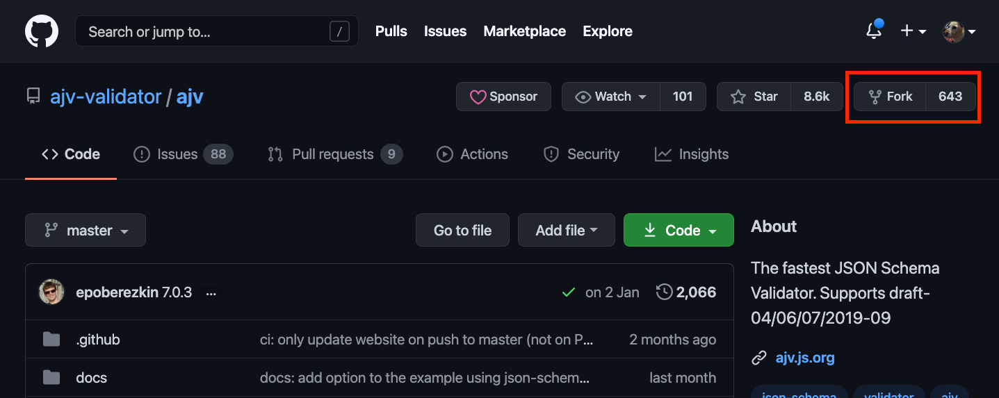
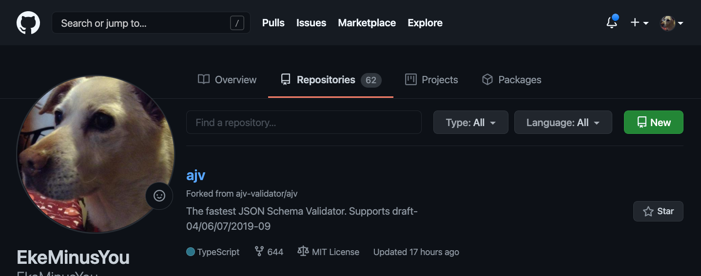
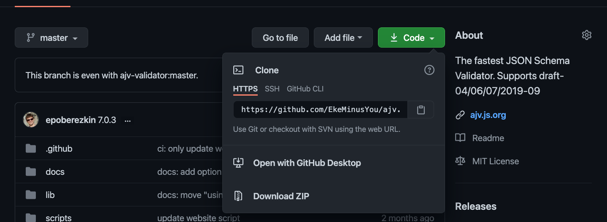

## まえがき
GitHubのOSS活動をはじめました。といってもREADMEを修正したりとか、ちょっとしたリファクタリングくらいですが。
GitHub自体はそれなりに理解していますが、OSS活動で使う操作は普段あまり使わないものがあるのでここでまとめてみます。
ただし、OSSごとにcontributeの方法の作法が違うようです。ここでは一般的な作法を記載するつもりですが、実際にOSSするときはCONTRIBUTE.mdを参照するようにしましょう。

## Fork
とにかくForkしましょう。



少し待つと自分のリポジトリにForkされます。



## Clone
Forkが終わったらCloneします。



```bash
$ git clone https://github.com/EkeMinusYou/ajv.git
```

## Branch管理
私は最初OSS活動するとき、大した変更でもなかったので、ついmasterでいいんじゃね、と思ってmasterで作業してしまいましたが、以下の理由でbranchを切るのがおすすめです。CONTRIBUTE.mdに書いてあったりします。

- PRがすぐmergeされるとは限らない
- 複数のPRを出すときは結局branchを切ることになる
- master/mainは最新の状態を保ちたい

## あとがき
別にそんなに書くことなかった。心なしか英語読むのに慣れてきた気がします。