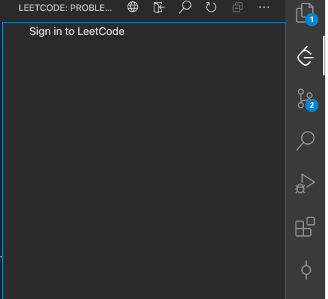
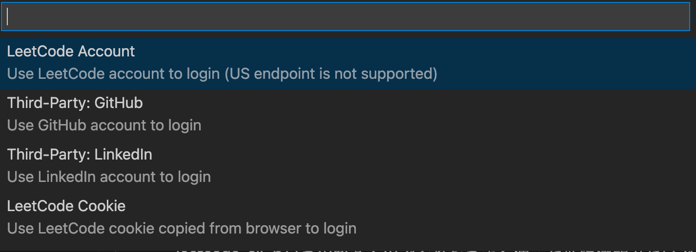
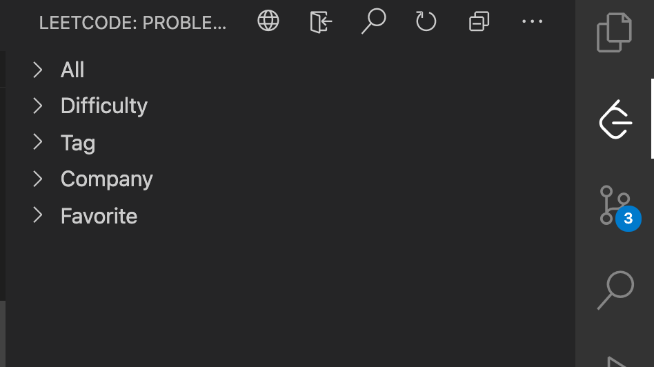
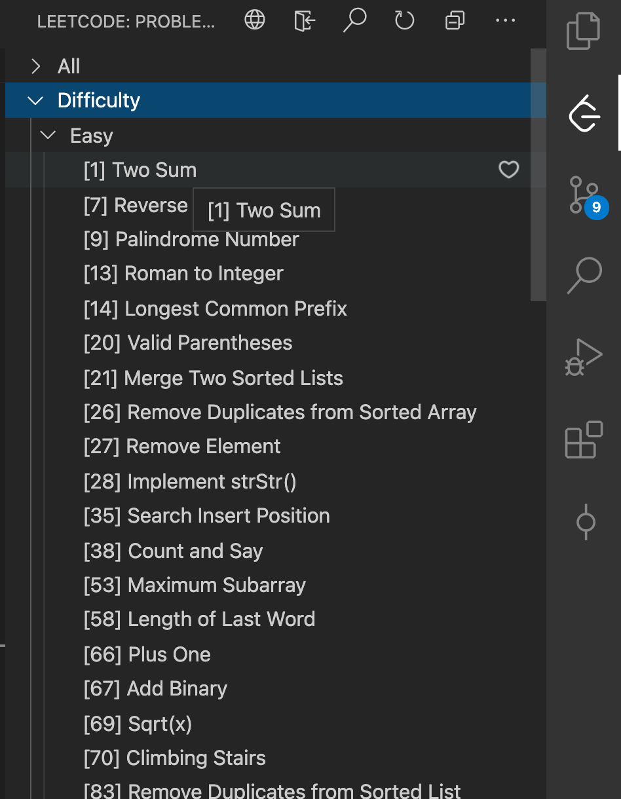
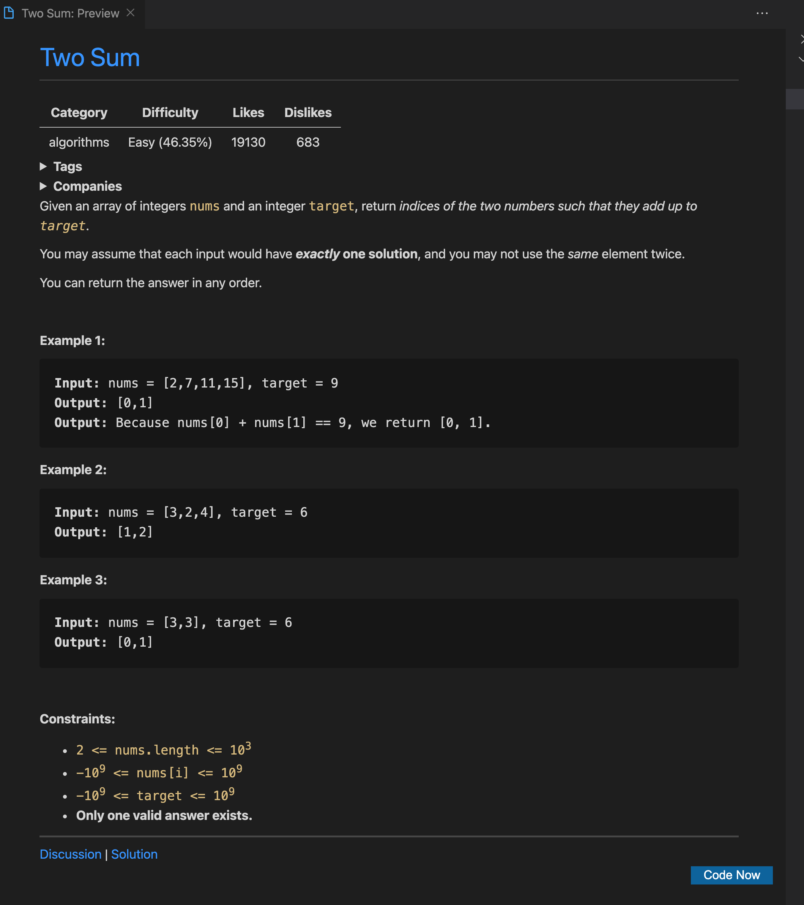
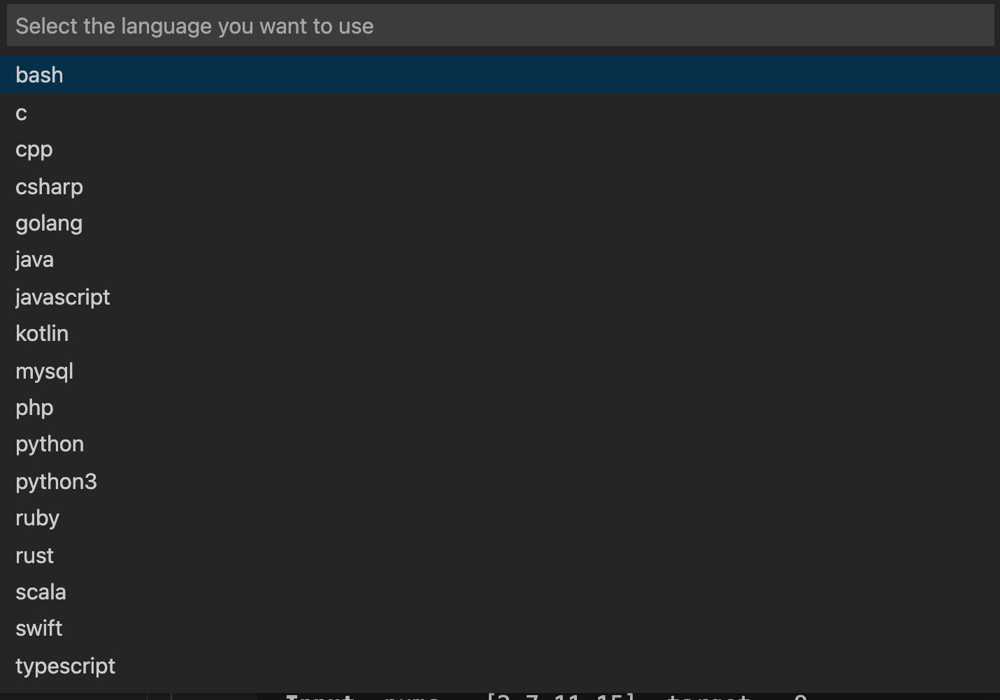
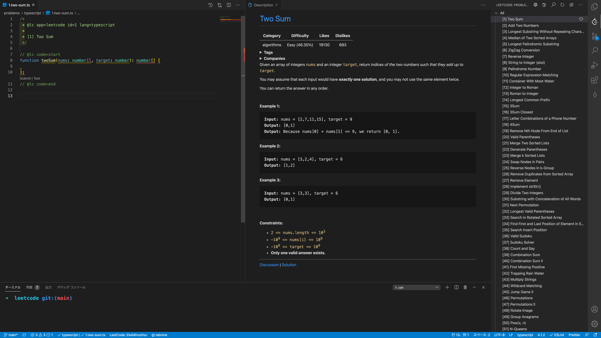
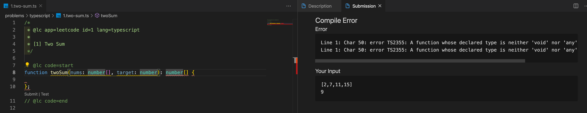

## まえがき

leetcode 始めようと思い環境を整備しました。

leetcode は日本ではそんなにメジャーではないですが、面接などで、エンジニアに出されるコーディング試験などを集めたものらしいです。日本でいう AtCoder みたいなものですね。

正直多少のパフォーマンスより可読性を重視した方が良いと思うのですが、バックエンドエンジニアをやりつつアルゴリズムがわからんというのも問題なので、挑戦してみようと思いました。

仕事で使っている主な言語は TypeScript なのですが、いつの間にか TypeScript も対応しているようでちょうどよかったです。

また、どうせなら以下の要件でやってみたく試してみました。案外簡単に整備できました。

- VSCode でコーディング
  - テーマやフォーマッターをいつもと同じにしたかった
- GitHub でコードを管理
  - 進捗がわかりやすくなるし対外的にアピールできるかも

## VSCode に leetcode の拡張機能を導入

こちらの拡張機能をインストールするだけです。中華製なのかな？

leetcode-cli というのがあるのでそれをうまく使った拡張機能みたいです。node が必要なのでもし入ってなかったら入れてください。

https://marketplace.visualstudio.com/items?itemName=LeetCode.vscode-leetcodes

### install & login

VSCode に leetcode の拡張機能を install したら以下のようにサイドバーに leetcode が追加されました。



Sign in を押してみると以下のようにログイン方法がリストで表示されます。

私は GitHub でログインしましたが、2factor 認証もそのまま入力できて地味にすごいなと思いました。



### problem

ログインすると以下のように表示が変わります。



どうやらここに problems のリスト並ぶようです。



試しに `Two Sum` をクリックしてみると Description が VSCode 上で閲覧できます。



右下の Code now から実際にコーディングを開始することができます。言語を選んで生成するファイルの場所を選ぶ必要があります。



こんな感じでコーディングを開始できます。最高ですね！

ファイル名が自動でついてくれるのがありがたい。



### test

test や submit も VSCode 上でできるようです。おもむろに test してみた結果が以下です。



### settings

生成される言語やファイルが生成される場所などは設定で指定することができます。私の場合は以下になります。

```json
{
	"leetcode.workspaceFolder": "/Users/mineo/Workspace/leetcode/problems/typescript",
	"leetcode.defaultLanguage": "typescript"
}
```

## GitHub で管理

push するだけ。こんな感じになった。eslint 導入しました。

https://github.com/EkeMinusYou/leetcode

## あとがき

振り返ると VSCode の拡張機能を入れて GitHub に push しただけです。
実はまだ 1 問も解いていないのでこれから頑張る。。。
